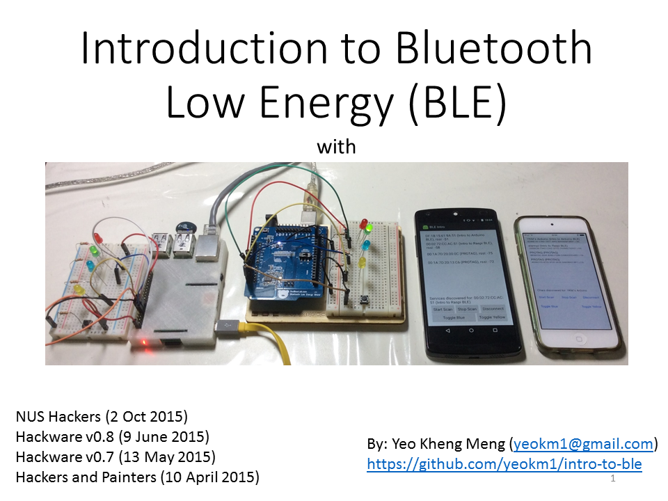

# intro-to-ble

A talk I gave to Hackware v0.7, v0.8 and Hackers & Painters to introduce the audience to basic Bluetooth Low Energy concepts followed by code explanations. 

Part 1 of my talk I gave at Hackware v0.7.

This covers Arduino and Android only.

Part 2 of my talk I gave at Hackware v0.8.

This covers Raspberry Pi, iOS, low-level BLE concepts and a BLE Sniffer hardware.

My slides are available on slideshare in the picture link below.

For more detailed information please consult the README.md in the 4 subfolders.
