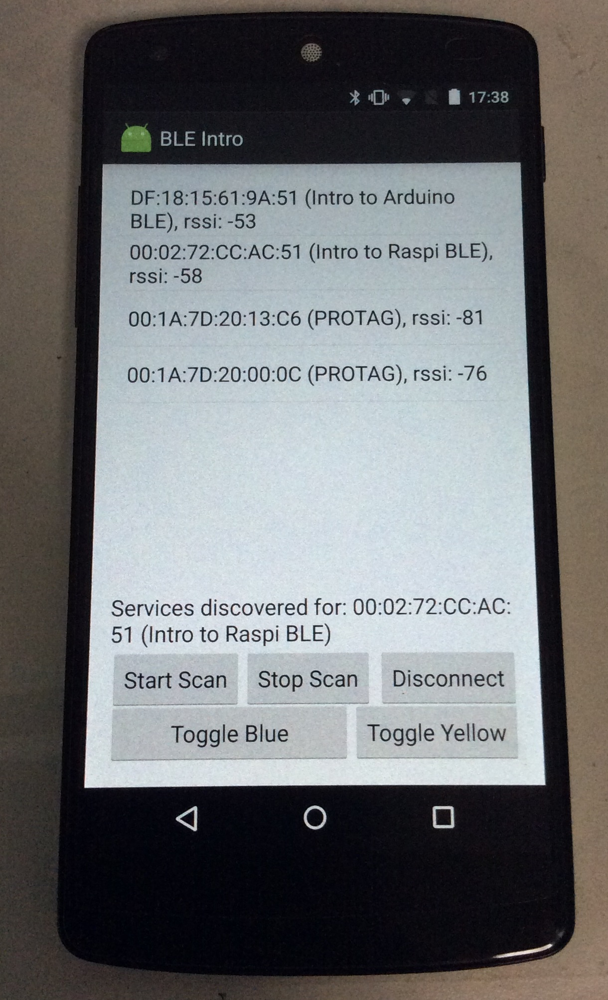

Intro to BLE (Android Central)
=============

This Android application is programmed to act as a Bluetooth Low Energy central as part of my talk on the introduction to BLE. Tested on Nexus 5 running Android 6.0.

##Software used
1. Android Studio 1.3.2
