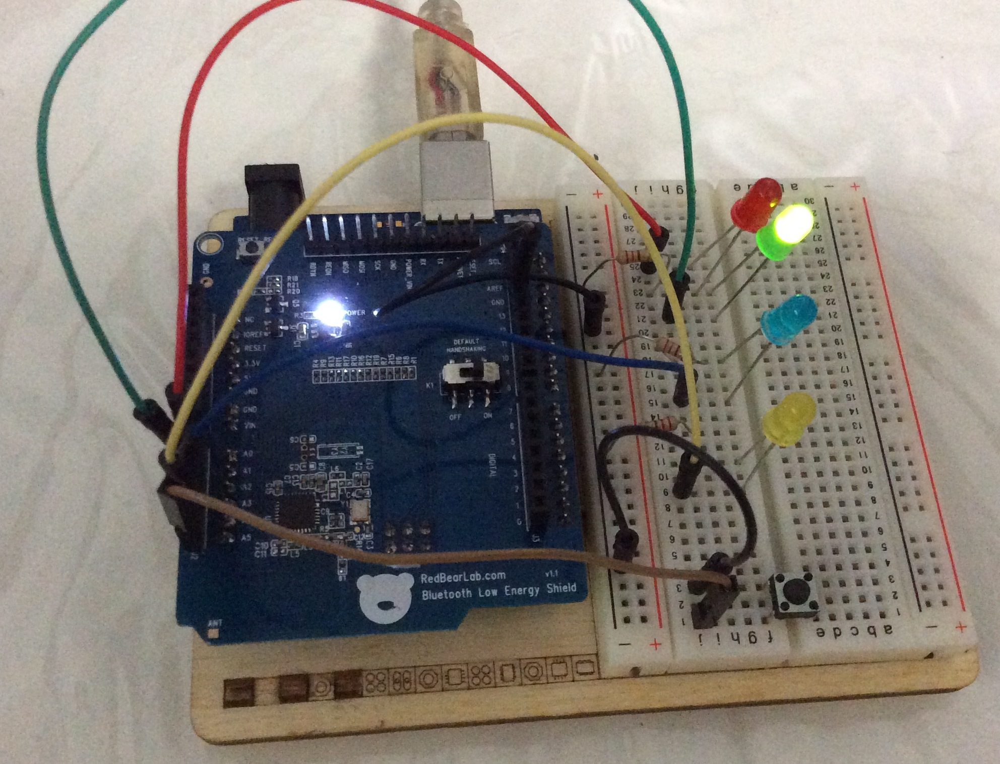
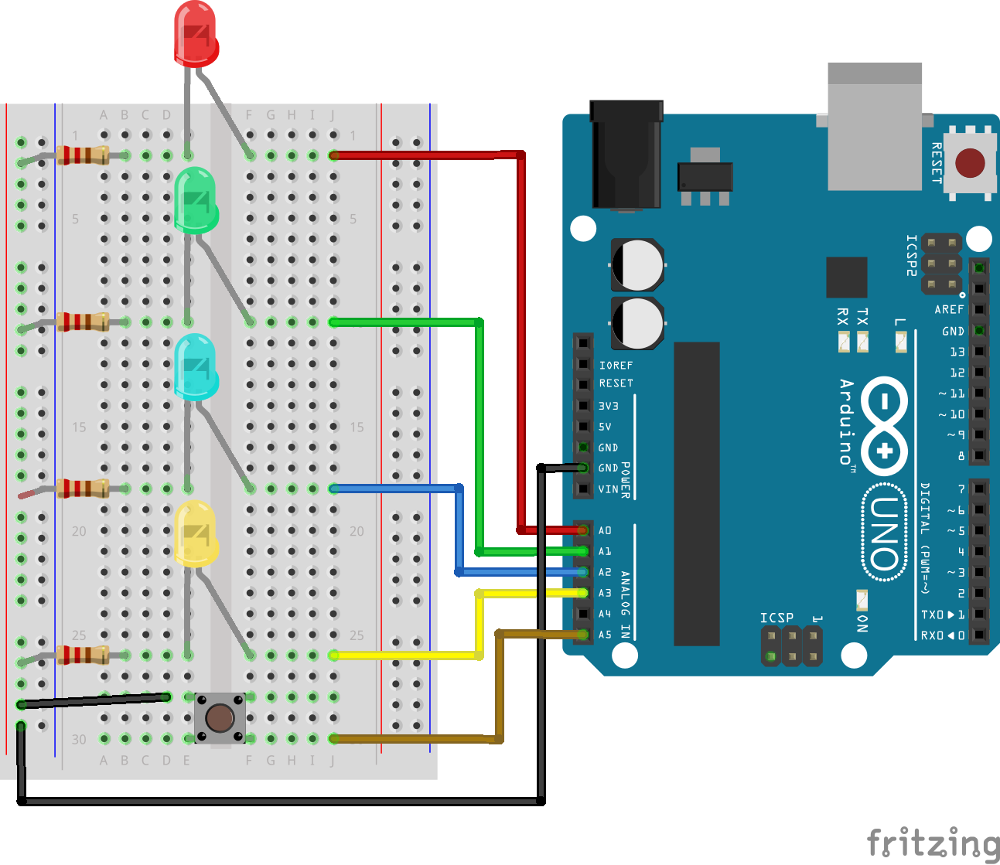

Intro to BLE (Arduino Peripheral)
=============

This Arduino is programmed to act as a Bluetooth Low Energy peripheral as part of my talk on the introduction to BLE.

##Parts used
1. Arduino Uno R3
2. RedBearLab BLE (Single-Mode) Shield v.1.1 (NRF8001 chipset)
3. Red LED
4. Green LED
5. Blue LED
6. Yellow LED
7. 4x 220ohm resistors
8. Push Button

BLE Shield is not shown in the schematic.

##Software/Libraries used
1. Arduino IDE 1.6.5
2. [Arduino BLE Peripheral by sandeepmistry.](https://github.com/sandeepmistry/arduino-BLEPeripheral)
