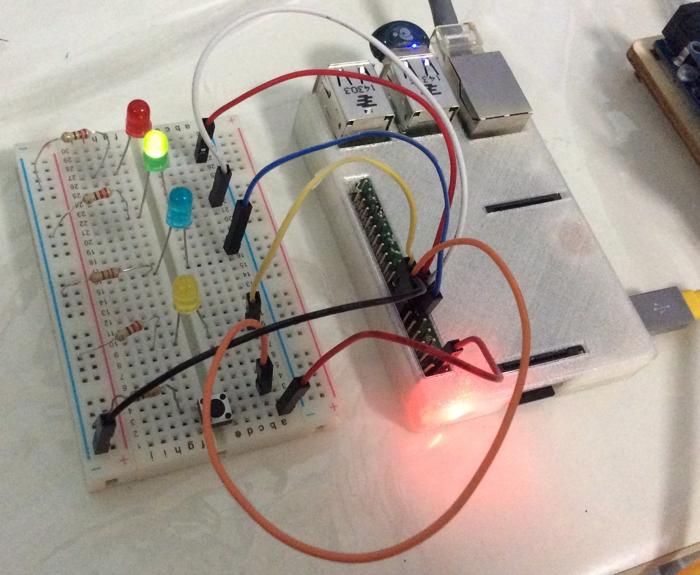
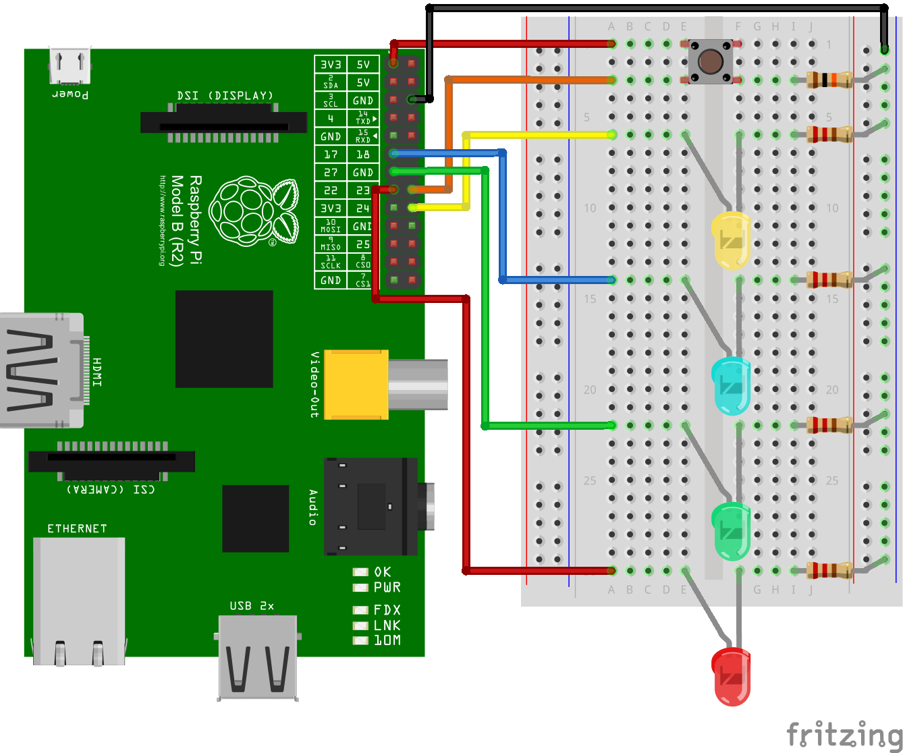

Intro to BLE (Raspberry Pi Peripheral)
=============

This Raspberry Pi is programmed to act as a Bluetooth Low Energy peripheral as part of my talk on the introduction to BLE.



##Parts used
1. Raspberry Pi 2 Model B (others will just as well)
2. IOGear GBU521 USB BLE (Dual-Mode) adapter
3. Red LED
4. Green LED
5. Blue LED
6. Yellow LED
7. 4x 220ohm resistors
8. Push Button
9. 10k ohm pull-down resistor



##Setup instructions

I personally prefer Arch Linux but I include instructions for Raspbian as well.

Arch Linux ARM
```bash
pacman -Syu python2 make gcc git bluez bluez-utils bluez-libs nodejs
git clone https://github.com/yeokm1/intro-to-ble.git
cd intro-to-ble/raspi_ble
npm install --python=python2.7
```

Raspbian
```bash
#Manually install latest nodejs as Raspbian's is severely out-of-date
sudo apt-get install bluetooth bluez-utils libbluetooth-dev
wget http://node-arm.herokuapp.com/node_latest_armhf.deb
sudo dpkg -i node_latest_armhf.deb
git clone https://github.com/yeokm1/intro-to-ble.git
cd intro-to-ble/raspi_ble
npm install
```

##Start on boot

Arch Linux only

```bash
nano /etc/systemd/system/intro-to-ble.service

#Add the following lines to intro-to-ble.service till but not including #end
[Unit]
Description=To start intro-to-ble on startup

[Install]
WantedBy=multi-user.target

[Service]
Type=idle
RemainAfterExit=yes
ExecStart=/root/intro-to-ble/raspi_ble/intro_ble_startup.sh
#end

systemctl enable intro-to-ble.service
```

##Read-only file system

I recommend a read-only file system in case rapid restarts are necessary in a demo and you don't wish to corrupt the SD card. Consult my [gist for Arch Linux](https://gist.github.com/yeokm1/8b0ffc03e622ce011010).

##Run instructions

Both
```bash
cd intro-to-ble/raspi_ble
```

Arch Linux only
```bash
hciconfig hci0 up
node ble.js
```

Raspbian only
```bash
sudo node ble.js
```

##Software/Libraries used
1. Nodejs
2. [Bleno by sandeepmistry](https://github.com/sandeepmistry/bleno)
3. [onoff GPIO by fivdi](https://github.com/fivdi/onoff)
